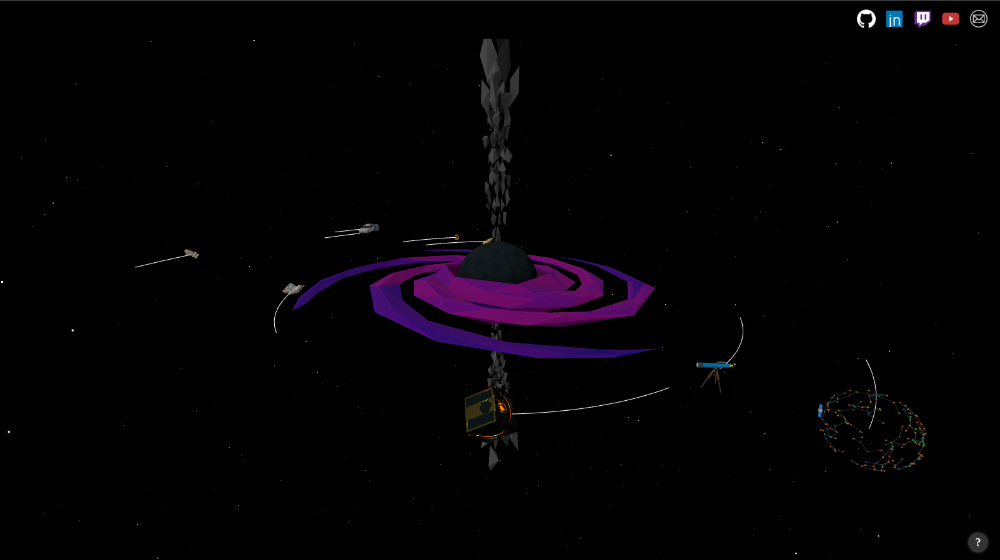

# 🌌 Portfolio – Built with Three.js & Vite

---

## Features

- 3D Black hole system with real physics
- Clickable planets that reveal detailed project info
- Smooth camera transitions and flyout UI panels
- Fully responsive and works across modern browsers

#### [Live Demo](https://portfolio-spottedbushs-projects.vercel.app/)

---

## 🛠️ Tech Stack

- [Three.js](https://threejs.org/) – 3D rendering engine
- [Vite](https://vitejs.dev/) – Lightning-fast bundler
- [GLTFLoader](https://threejs.org/docs/#examples/en/loaders/GLTFLoader) – For 3D models
- [OrbitControls](https://threejs.org/docs/#examples/en/controls/OrbitControls) – For camera movement
- [JavaScript (ES6+)](https://developer.mozilla.org/en-US/docs/Web/JavaScript)

---

## 📁 Project Structure

<pre>
├── public/ # Static assets (images, models, textures)
├── src/ # Source code
│ ├── components/ # Reusable scene components and UI logic
│ ├── scenes/ # Scene and environment setup
│ ├── utils/ # Helper functions (e.g., camera, loading)
│ └── main.js # App entry point
├── vite.config.js # Vite configuration
└── index.html # Main HTML file
<pre>
