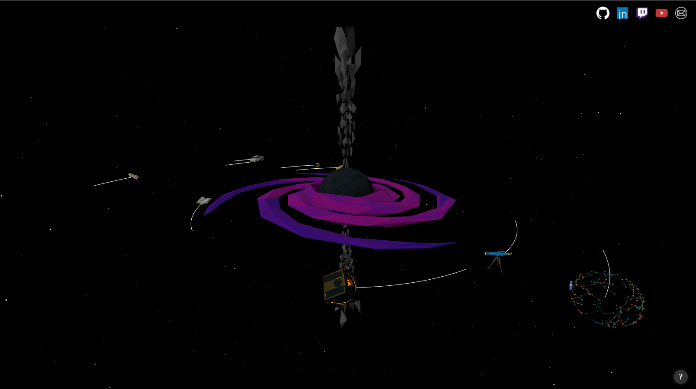

# 🌌 Starfolio

---

## ✨ Features

- 3D Black hole system with real physics
- Clickable planets that reveal detailed project info
- Smooth camera transitions and flyout UI panels
- Fully responsive and works across modern browsers (Mobile or tablet versions are not handled)
- Achievements with rewards

#### [Live Demo](https://Starfolio-spottedbushs-projects.vercel.app/)

---

## 🛠️ Tech Stack

- [JavaScript (ES6+)](https://developer.mozilla.org/en-US/docs/Web/JavaScript)
- [Three.js](https://threejs.org/) – 3D rendering engine
- [Vite](https://vitejs.dev/) – Lightning-fast bundler
- [Blender](https://www.blender.org/) - For creating my own 3D models
- [Vercel](https://portfolio-spottedbushs-projects.vercel.app/) - Hosting the Starfolio live

---

## 📁 Project Structure

<pre>
├── public/ # Static assets (images, models, textures, musics)
│ ├── css/ - Css files (for styling the html objects)
│ ├── cursor/ - custom cursor files
│ ├── icons/ - Images for everything in this projects (Buttons, favicon, ...).
│ │ ├── achievements/
│ │ └── musicPlayerIcons/
│ ├── planets/ - 3D Models under glb format
│ ├── misc/ - Miscellanous
│ └── musics/
│   ├── covers/ - Cover png images
│   └── tracks/ - Tracks mp3 files
├── src/ # Source code
│ ├── camera/ # Camera navigation logic
│ ├── data/ # Physic constants and projects data 
│ ├── scene/ # Scene and environment setup
│ ├── ui/ # UI logic
│ │ └── achievements/ - Achievements logic
│ └── main.js # App entry point
├── vite.config.js # Vite configuration
├── index.html # Main HTML file
└── package.json # JSON scrips and dependencies
